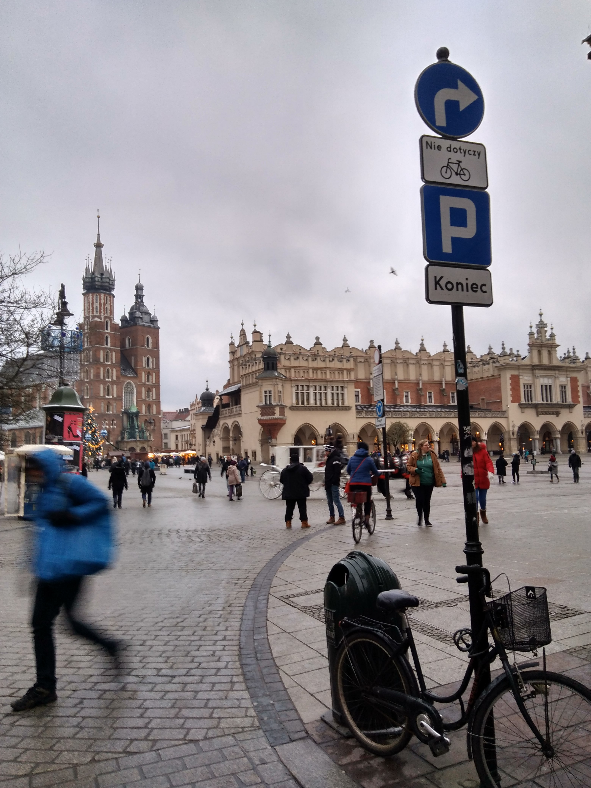
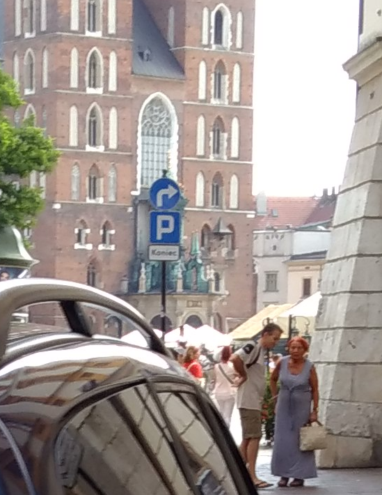

Szanowna Pani(e),

Zgłaszam do modyfikacji znak "Nakaz skrętu" z Szczepańskiej w prawo (czyli działa jak zakaz skrętu w Sławkowską). Po pierwsze - ten znak nie jest tam potrzebny, tylko brzydko wygląda - wystarczy zakaz wjazdu na początku Sławkowskiej. Ruch pojazdów które nie mogą skręcić w lewo jest tam nieduży a znak brzydko wygląda. Pod drugie - w tym momencie powoduje on iż skręt rowerem w Sławkowską jest nielegalny, mimo iż jest ona dwukierunkowa dla rowerów.

Proponowałbym likwidację znaku lub dodanie tabliczki T-22.

lokalizacja: http://www.openstreetmap.org/?mlat=50.06286&mlon=19.93675#map=18/50.06286/19.93675

Z poważaniem,
Mateusz Konieczny

# 0 underscore

# 1 underscore

# 2 underscore

# 3 underscore

# Wat

# Przed

# Po

