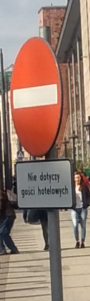
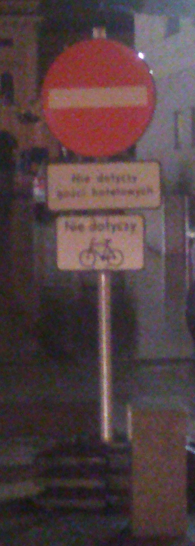
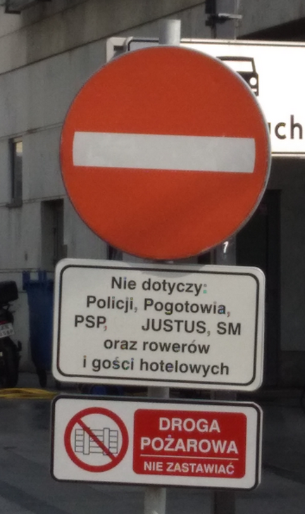

poszło na informacja@galeriakrakowska.pl z http://www.galeriakrakowska.pl/pl/kontakt,16

Szanowna Pani/Panie,

Na początek chciałbym podziękować za chyba najlepszy w Krakowie prywatny parking rowerowy. Jest jednak z nim pewien problem, nie można do niego legalnie dojechać rowerem.

Z związku z tym mam pytanie - kto administruje placem Jana Nowaka Jeziorańskiego?

Na wjeździe na plac Jana Nowaka Jeziorańskiego znajduje się znak zakaz ruchu. Potrzeba dodać pod nim tabliczkę T-22 "nie dotyczy rowerów jednośladowych" (dotyczy wjazdu na przedłużeniu ulicy Worcella - lokalizacja: http://www.openstreetmap.org/?mlat=50.0659&mlon=19.9453#map=16/50.0659/19.9453 ). W tym momencie mogą już tam wjeżdżać goście hotelowi, zmiana ta zalegalizuje dojazd do stojaków rowerowych przy wejściach do galerii Krakowskiej i dworcu PKP.

Zarząd Infrastruktury Komunalnej i Transportu twierdzi że oni tym obiektem nie administrują i nie mogą w tej sprawie czegokolwiek zrobić.

z poważaniem,
Mateusz Konieczny

# Przed

# Po

